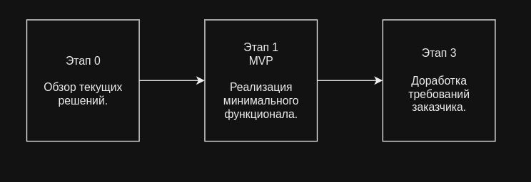

# ML System Design Doc 

### 1. Цели и предпосылки 
#### 1.1. Зачем идем в разработку продукта?  

**Бизнес-цель**: создание инструмента для автоматизированной оценки качества звонков операторов колл-центров. Для оценки качества будет использоваться показатель CQR (Call Quality Rate), с анализом по следующим критериям:

1. Успешность звонка: выполнил ли оператор цель звонка. Звонок считается успешным, если оператор смог решить проблему или удовлетворить запрос клиента. Если целью звонка является продажа продукта или услуги, успешным считается звонок, в результате которого была заключена сделка.
2. Удовлетворенность клиента: был ли клиент удовлетворен звонком?
3. Эмоциональный настрой и ясность диалога.

**Почему станет лучше, чем сейчас, от использования ML**: Использование машинного обучения позволит автоматизировать процесс оценки качества звонков, что приведет к уменьшению субъективности в оценках, снижению трудозатрат и увеличению скорости. Появится возможность охватывать большой объем звонков (сейчас в бизнесе чаще используют подход веерной проверки - около 10% от всех звонков). Это позволит компаниям лучше понимать, как повысить качество обслуживания клиентов и обучить операторов.

**Что будем считать успехом с точки зрения бизнеса**: Работающая модель, предоставляющая оценку качества звонка по заданным критериям, а также отчет с более подробным анализом звонка (по запросу).

Побочные бизнес-цели при внедрении модели:
- Улучшение качества предоставляемых услуг в рамках работы колл-центров,
- Повышение лояльности клиентов.

#### 1.2. Бизнес-требования и ограничения

  *на первой итерации предполагается проверка реализации идеи - MVP с минимальным функционалом*

**Целевое решение**: Система оценки качества звонков с помощью машинного обучения

##### Логика работы:

1. Система получает аудиозаписи звонков.
2. Происходит анализ контента, включая речь, интонации, эмоциональную окраску, а также содержание диалогов.
3. Звонок получает оценку с учетом заранее определенных метрик Call Quality Rate.
4. Система формирует оценки и отчеты для каждого оператора и каждого звонка.

##### Бизнес-ограничения:

- Гибкость настройки: Система должна предоставлять возможность настройки параметров оценки, чтобы учитывать специфические требования бизнеса.

- Типы звонков: Оценка качества должна проводиться для разных типов звонков, например, входящих и исходящих, а также для разных целевых аудиторий, если это применимо к бизнесу.

- Скорость обработки: Система должна обеспечивать высокую скорость обработки звонков и предоставления результатов, чтобы оперативно давать обратную связь.

- Конфиденциальность данных: Система должна обеспечивать высокий уровень конфиденциальности данных клиентов и операторов, следуя соответствующим нормативным требованиям и законодательству.

##### Критерии успеха и возможные пути развития проекта:

Успех будет измеряться по следующим параметрам:
- Уменьшение субъективности оценок операторов и повышение точности оценки Call Quality Rate.
- Уменьшение времени, затрачиваемого на оценку каждого звонка и формирование отчетов.
- Повышение уровня удовлетворенности клиентов с качеством обслуживания.

**Возможные пути развития проекта:**
- Расширение функциональности системы для оценки других аспектов обслуживания клиентов, таких как скорость ответа на звонки, разрешение проблем и т. д.
- Разработка пользовательского интерфейса для удобного доступа к результатам оценок и статистике.
- Интеграция с другими системами колл-центра и CRM для автоматической обратной связи с операторами и управления обслуживанием клиентов.
- Оценка качества звонков в режиме реального времени.

#### 1.3. Что входит в скоуп проекта/итерации, что не входит   

#### 1.4. Предпосылки решения  

1. Увеличение объема обработки данных: Бизнес, особенно в сфере обслуживания клиентов, сталкивается с ростом объема звонков. Ручное оценивание каждого звонка становится неэффективным. Компании нуждаются в инструментах, способных быстро и точно оценивать качество звонков.

2. Субъективность и неоднородность оценок: Оценка качества звонков операторами колл-центров, проводимая человеком, может быть субъективной и подвержена разной интерпретации. Это может привести к несправедливой оценке операторов и неверной обратной связи.

3. Технологический прогресс в анализе данных и ML: Современные технологии анализа речи и машинного обучения позволяют автоматизировать оценку качества звонков, выявлять тренды и применять объективные метрики, что ранее было сложно или невозможно сделать вручную.

### 2. Методология 

#### 2.1. Постановка задачи  

- Категоризация интонаций голоса по аудиозаписям
- Модель для оценки качества звонков

#### 2.2. Блок-схема решения  

#### 2.3. Этапы решения задачи   

> - Этап 0 - Формирование идеи, обзор решений

> - Этап 1 - Реализация MVP

> - Этап 2 - Доработка требований заказчика
  
#### 2.4 Архитектура

Для решения задачи оценки качества звонка по аудиозаписи планируется использовать следующую архитектуру системы:

1. Пользователь отправляет аудиофайл через телеграмм бот.
2. Телеграмм бот загружает аудиофайл и сохраняет его на сервере.
3. Загруженный аудиофайл передается обученной модели для определения эмоционального состояния и оценки качества.
4. Модель обрабатывает аудиофайл и возвращает результаты, то есть определенное эмоциональное состояние + оценку.
5. Телеграмм бот получает результаты от модели.
6. Телеграмм бот отправляет результаты пользователю через интерфейс бота.

Важно учесть следующие аспекты при проектировании архитектуры:

- Поддержка различных форматов аудиофайлов: система должна быть способна обрабатывать различные типы аудиофайлов, например, WAV, MP3, FLAC и другие.
- Безопасность: система должна обеспечивать безопасное хранение и обработку пользовательских данных, включая аудиозаписи.
- Масштабируемость: архитектура должна быть спроектирована таким образом, чтобы легко масштабировать ее в случае увеличения нагрузки на систему.
- Продуктивность: система должна обеспечивать быструю и эффективную обработку аудиофайлов для минимизации времени ожидания.

Предлагаемая архитектура позволяет обеспечить загрузку аудиофайла через телеграмм бот, обработку данных обученной моделью и отправку результатов назад через бот. Она также позволяет легко внедрить дополнительные компоненты, например, модуль предварительной обработки аудио данных или модуль сохранения истории запросов и результатов.

### 3. Подготовка пилота  

##### Для реализации минимально функционала была выбрана следущая архитектура

##### Железные ограничения:
Данные для видеокарты GPU Tesla P100 16G
1.	При работе предобученной модели GPU возможна только с фрагментами звукового файла длительностью не более 15 секунд. При обработке файла с большей длительностью приходится резать его на части по 10 секунд, делать предсказания по каждой части и ориентироваться на моду предсказаний.
2.	Производительность GPU на аудио фрагментах средней длительностью 5 сек в диапазоне 20-25 файлов в секунду.
3.	Работа с форматами, отличными от WAV, требует предварительной конвертации файла в WAV-формат.
4.	Особые требования по энергоснабжению и охлаждению системы.

#### 3.1. Способ оценки пилота  

**Инженерные метрики (ML метрики):**
Качество модели будем оценивать по метрикам:
- **recall,** т.к. эта метрика показывает, какую долю объектов данного класса из всех объектов этого класса нашел алгоритм; 
- **F-мера** (средневзвешенная) как среднее гармоническое precision и recall; 
- **ROC-AUC,** т.к. это критерий устойчив к несбалансированным классам.  С усредняющим параметром average="micro". В этом случае ROC-AUC, усредняет результаты для каждого класса, но с учетом количества положительных и отрицательных примеров для каждого класса. Нам важно учитывать баланс классов.

ML-метрики будем сравнивать с **Baseline** от авторов датасета Dusha: https://github.com/salute-developers/golos/tree/master/dusha

  
#### 3.2. Что считаем успешным пилотом  
  
#### 3.3. Подготовка пилота  
  
